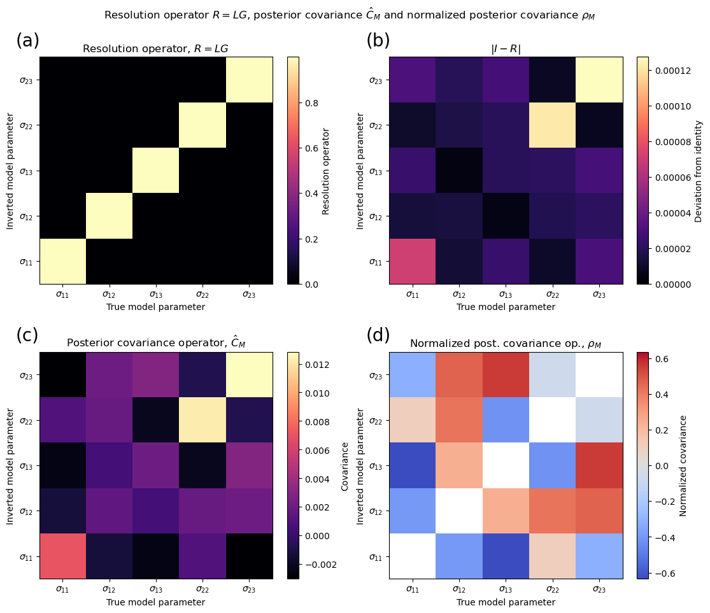

# StressInversionResolution
On the analysis of the resolution operator and posterior covariance matrix in stress tensor inversions (geophysics).
--------------------------------------------------------------------------------------------------------------------

This repository provides supporting material for: 
**The importance of nodal plane orientation diversity for earthquake focal mechanism stress inversions.**
Jens-Erik Lundstern, Eric Beaucé and Orlando J. Teran

